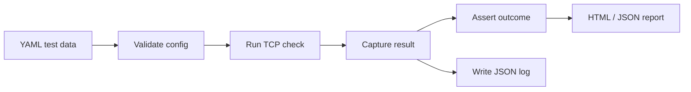

# Network Service Test Automation Framework

[](https://github.com/Anjalisingh127/network-service-test-framework/actions/workflows/ci.yml)


[](LICENSE)

A configuration-driven **Python/pytest framework** for testing TCP service
connectivity, availability, and request/response behavior without depending on
public services.

The framework reads YAML test data, executes TCP checks, compares expected and
actual responses, measures latency, records structured diagnostics, and produces
HTML/JSON test evidence in GitHub Actions.

## At a glance

| Engineering evidence | Verified result |
| --- | --- |
| Automated tests | **34 passing** |
| Test composition | **31 unit + 3 integration** |
| CI environment | **Python 3.12 on GitHub Actions** |
| Quality gates | **Ruff linting and formatting** |
| Test evidence | **Self-contained HTML + JSON reports** |
| External test dependency | **None — loopback TCP fixtures only** |

- [View the latest CI runs](https://github.com/Anjalisingh127/network-service-test-framework/actions)
- [View the verified test report summary](docs/sample-test-report.md)

## Why this project?

TCP checks are often written as one-off scripts with hard-coded hosts, unclear
failures, and unreliable dependencies on public endpoints. This project turns
that workflow into a small, reusable testing framework:

- Service definitions live in YAML instead of test code.
- Network failures are converted into consistent, inspectable outcomes.
- Assertions include endpoint, latency, error, and response evidence.
- Integration tests run against a deterministic local TCP server.
- CI reproduces the same checks and preserves reports as artifacts.

## Core capabilities

- Validate TCP connectivity within a configurable timeout.
- Send UTF-8 requests and capture service responses.
- Compare expected and actual responses exactly.
- Distinguish connection refusal, timeout, network error, mismatch, and empty response.
- Measure elapsed connection/response latency using `perf_counter`.
- Produce JSON-lines diagnostic logs for successful and failed checks.
- Drive multiple checks from validated YAML test data.
- Reuse result assertions across unit and integration scenarios.

## How it works



```text
Test data → Validate → Connect → Send → Receive → Compare → Log → Report
```

Detailed design: [docs/architecture.md](docs/architecture.md)

## Quick start

### 1. Clone and install

```powershell
git clone https://github.com/Anjalisingh127/network-service-test-framework.git
cd network-service-test-framework

py -m venv .venv
.\.venv\Scripts\python.exe -m pip install --upgrade pip
.\.venv\Scripts\python.exe -m pip install -e ".[dev]"
```

> Requires Python 3.12 or newer. On macOS/Linux, use `.venv/bin/python` in place
> of `.\.venv\Scripts\python.exe`.

### 2. Define a service

```yaml
services:
  - name: local-echo
    host: 127.0.0.1
    port: 9001
    timeout_seconds: 2
    request: PING
    expected_response: PONG
```

The loader validates required fields, data types, port ranges, positive
timeouts, and unique service names before any network call is attempted.

### 3. Run configured checks

```python
from netcheck import configure_logging, run_from_config

configure_logging("logs/netcheck.jsonl")
results = run_from_config("config/services.yaml")

for result in results:
    print(
        result.service_name,
        result.status.value,
        result.latency_ms,
        result.actual_response,
    )
```

The configured service must be running at its target endpoint. The automated
test suite starts its own local TCP fixtures and does not require internet
access.

## Normalized outcomes

| Status | Meaning |
| --- | --- |
| `available` | TCP connection established successfully |
| `connection_refused` | Target actively rejected the connection |
| `timed_out` | Connection or response exceeded the configured timeout |
| `network_error` | Another operating-system network error occurred |
| `response_received` | A non-empty response arrived without an expected value |
| `response_match` | Actual response exactly matched the expected response |
| `response_mismatch` | Actual and expected responses differed |
| `empty_response` | Connection closed without response data |

Every result retains the service name, host, port, status, success flag,
latency, error message, and expected/actual response where applicable.

## Testing

```bash
# Complete suite
python -m pytest -v

# Individual layers
python -m pytest -m unit -v
python -m pytest -m integration -v

# Quality checks
python -m ruff check .
python -m ruff format --check .
```

The three integration tests validate:

1. Real TCP connectivity to a loopback service.
2. A real `PING` → `PONG` request/response exchange.
3. The complete YAML → execution → assertion workflow.

More detail: [docs/testing.md](docs/testing.md)

## Generate reports

```bash
python -m pytest \
  --html=reports/report.html \
  --self-contained-html \
  --json-report \
  --json-report-file=reports/report.json
```

GitHub Actions runs linting, formatting verification, unit tests, integration
tests, and report generation on every push and pull request to `main`. The
workflow uploads `network-service-test-reports` as a downloadable artifact.

## Project structure

```text
network-service-test-framework/
├── .github/workflows/ci.yml     # Automated quality gates and reporting
├── config/services.yaml         # Service test data
├── docs/                        # Architecture and test evidence
├── src/netcheck/
│   ├── client.py                # TCP connectivity and response execution
│   ├── config.py                # YAML loading and validation
│   ├── exceptions.py            # Framework-specific errors
│   ├── logging_config.py        # JSON-lines logging
│   ├── models.py                # Immutable input and result models
│   ├── runner.py                # Configuration-driven orchestration
│   └── validators.py            # Reusable result assertions
├── tests/
│   ├── fixtures/                # Deterministic local TCP server
│   ├── integration/             # Real loopback workflow tests
│   └── unit/                    # Isolated behavior and failure tests
├── pyproject.toml
└── README.md
```

## Engineering decisions

- **No public endpoints in tests:** avoids DNS, internet, and third-party availability failures.
- **Structured result objects:** preserve evidence instead of returning only `True` or `False`.
- **Immutable configuration models:** prevent accidental mutation during a test run.
- **Monotonic timing:** avoids incorrect latency caused by wall-clock adjustments.
- **Separate unit and integration markers:** supports fast feedback and focused execution.
- **Small dependency set:** the networking layer uses Python's standard `socket` library.

## Documentation

- [Architecture and design decisions](docs/architecture.md)
- [Testing strategy](docs/testing.md)
- [Verified CI report summary](docs/sample-test-report.md)

## License

Licensed under the [MIT License](LICENSE).
