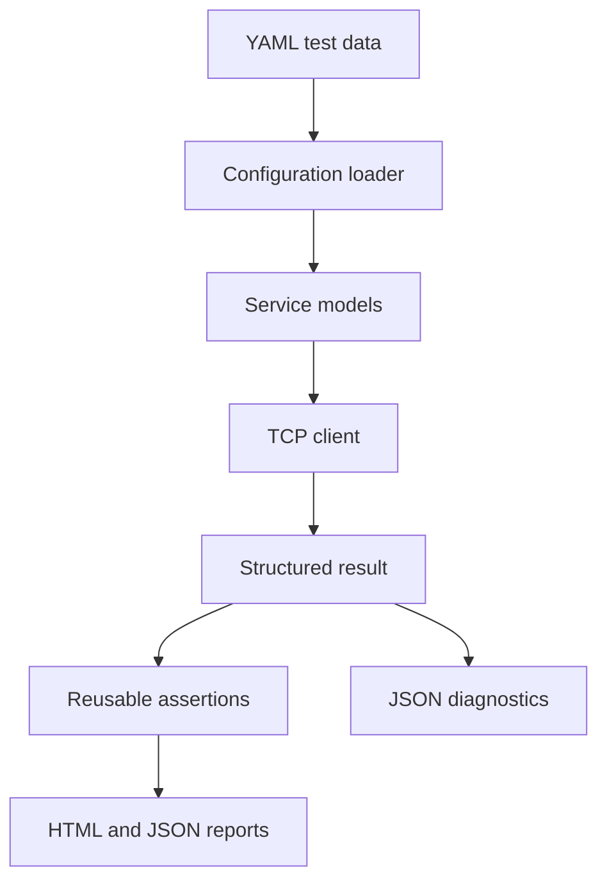

# Network Service Test Automation Framework

[](https://github.com/Anjalisingh127/network-service-test-framework/actions/workflows/ci.yml)

A configurable Python and pytest framework for validating TCP service
connectivity, availability, and request/response behavior. It converts YAML test
data into repeatable checks and records normalized outcomes, latency, structured
diagnostics, and expected-versus-actual response evidence.

## What it validates

- TCP connectivity within a configurable timeout
- Service availability, refusal, timeout, and network-error outcomes
- UTF-8 request sending and response capture
- Exact expected-versus-actual response matching
- Empty and undecodable response handling
- Latency measurement using a monotonic high-resolution clock
- JSON-lines diagnostic logging
- Deterministic unit and loopback integration tests

## Verified quality evidence

| Evidence | Result |
| --- | --- |
| Automated tests | 34 passing |
| Unit tests | 31 passing |
| Integration tests | 3 passing |
| Python CI version | 3.12 |
| Static checks | Ruff lint and format checks passing |
| Reports | Self-contained HTML and machine-readable JSON |
| External test dependency | None |

The first complete CI run is available in [GitHub Actions](https://github.com/Anjalisingh127/network-service-test-framework/actions/runs/35520638883).

## Architecture



See [Architecture](docs/architecture.md) for module responsibilities and design
decisions.

## Local setup

Python 3.12 or newer is required.

```powershell
py -m venv .venv
.\.venv\Scripts\python.exe -m pip install --upgrade pip
.\.venv\Scripts\python.exe -m pip install -e ".[dev]"
```

## Define test data

```yaml
services:
  - name: local-echo
    host: 127.0.0.1
    port: 9001
    timeout_seconds: 2
    request: PING
    expected_response: PONG
```

Each service requires a unique name, host, and valid TCP port. A request is
required when an expected response is configured. Invalid YAML and invalid field
values fail with a clear `ConfigurationError` before network execution begins.

## Run configured checks

```python
from netcheck import configure_logging, run_from_config

configure_logging("logs/netcheck.jsonl")
results = run_from_config("config/services.yaml")

for result in results:
    print(result.service_name, result.status, result.latency_ms)
```

The target services must be running at their configured endpoints. Automated
tests use local fixtures and never require a public service.

## Run tests

```powershell
.\.venv\Scripts\python.exe -m pytest -v
.\.venv\Scripts\python.exe -m pytest -m unit -v
.\.venv\Scripts\python.exe -m pytest -m integration -v
.\.venv\Scripts\python.exe -m ruff check .
.\.venv\Scripts\python.exe -m ruff format --check .
```

Generate reports:

```powershell
.\.venv\Scripts\python.exe -m pytest `
  --html=reports/report.html `
  --self-contained-html `
  --json-report `
  --json-report-file=reports/report.json
```

GitHub Actions runs the same quality gates on every push and pull request to
`main`, then uploads both reports as the `network-service-test-reports` artifact.

See [Testing](docs/testing.md) and the [sample test report](docs/sample-test-report.md)
for the verified test strategy and evidence.

## Project structure

```text
src/netcheck/          Framework code
tests/unit/            Isolated behavior and failure tests
tests/integration/     Real loopback TCP workflow tests
tests/fixtures/        Deterministic local TCP server
config/                YAML service definitions
docs/                  Architecture and testing evidence
reports/               Generated local reports (ignored by Git)
.github/workflows/     CI pipeline
```

## License

Licensed under the [MIT License](LICENSE).
